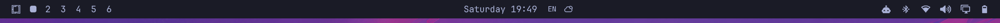
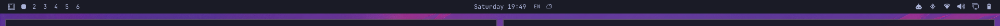
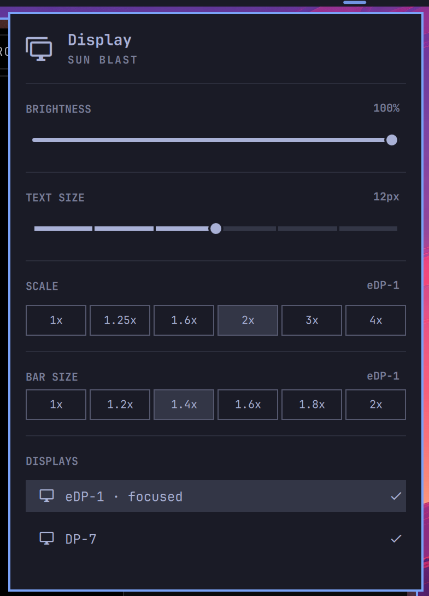

# Bar Zoom

**Size the Omarchy bar per monitor.**

On a mixed-DPI setup the Omarchy bar is sized once for the whole desktop. A 13"
4K laptop panel and a 1080p external monitor get the same bar, so it is either
comfortable on one and tiny on the other, or comfortable on the other and
oversized on the first. There is no per-monitor setting to change, because
Omarchy's `Style` is a QML singleton — one object shared by every bar on every
screen.

This plugin makes the bar's size a per-monitor setting, adjustable from the
Display panel you already use.



*The internal display's bar at 1.4x.* The external monitor on the same desktop,
left at 1x, is untouched:



A **BAR SIZE** row is added to the Display panel, working exactly like the SCALE
row above it — it applies to whichever monitor has focus, and names it on the
right:



## Install

```bash
omarchy plugin add https://github.com/jramiresbrito/omarchy-bar-zoom.git --enable
```

The plugin ships both halves — the bar and the Display panel — so one install is
all it takes. Enabling it switches the shell to this bar and offers to place its
Display widget; put it where the stock one lives:

```bash
omarchy bar move io.github.jramiresbrito.bar-zoom --section right
```

Then drop Omarchy's own Display widget so you are not carrying two of them.
`omarchy bar` has no remove verb — taking a widget out of the bar is an edit to
the layout in `~/.config/omarchy/shell.json`:

```bash
jq '.bar.layout |= map_values(map(select(.id != "omarchy.monitor")))' \
  ~/.config/omarchy/shell.json > /tmp/shell.json &&
  mv /tmp/shell.json ~/.config/omarchy/shell.json
```

Or open that file and delete the `{ "id": "omarchy.monitor" }` entry from
whichever `bar.layout` section holds it. Either way the shell hot-reloads on
save; no restart needed.

Want to compare the two side by side first? Skip this step — both render
happily, and you can come back to it once you have picked one.

## Use

1. `SUPER + CTRL + D` opens the Display panel.
2. Focus the monitor you want to change — **BAR SIZE** names its target, the
   same way SCALE does.
3. Pick a factor. `1x` is stock; the active one is highlighted.

Mouse and keyboard both work: `h` / `l` walk the row, Enter applies.

### Without the panel

The panel is a convenience; the bar reads its factors straight from
`~/.config/omarchy/shell.json`, keyed by the connector name Hyprland reports
(`hyprctl monitors -j | jq -r '.[].name'`):

```jsonc
{
  "bar": {
    "scaleByMonitor": {
      "eDP-1": 1.4
    }
  }
}
```

The shell watches that file, so the bar resizes as soon as you save. A monitor
with no entry renders at `1.0`. Because `1x` is the default it is stored as *no
entry* rather than `1.0`, so a monitor you have never zoomed reads as `1x`.

The bundled helper does the same thing from a shell:

```bash
bin/bar-zoom up        # step the focused monitor up
bin/bar-zoom 1.4       # set an exact factor
bin/bar-zoom reset     # back to stock for that monitor
```

## Requirements

- Omarchy **4.0.3** or newer (developed and tested against 4.0.3-1)
- `jq` and `hyprctl`, both of which Omarchy already installs

## How it works

`Style` is a QML singleton, so its font tokens are necessarily one value for the
whole desktop — there is no per-screen font size to write. Each bar *surface*,
however, is its own window with its own `screen`.

So the bar lays its content out at the natural size inside a wrapper item and
applies a `Scale` transform to that wrapper, sized from `barScaleFor(screen)`.
Glyphs and icons magnify together and the panel's implicit size grows by the
same factor, so the bar stays proportional instead of becoming a tall strip
around small text.

The diff against Omarchy's stock components is deliberately small — a lookup
function, a wrapper item, the panel's implicit size, and the new UI row.
`docs/limitations.md` lists it.

## Known limitations

**Zoom sharpness depends on the monitor's Hyprland scale.** The bar is magnified
at render time rather than laid out at a larger font size, so it is only as
sharp as the pixels that monitor gives it. A display at scale 2 is already drawn
at double resolution and absorbs the zoom with room to spare; a display at scale
1 has nothing spare, so text softens visibly. **Zoom your HiDPI monitors, leave
scale-1 monitors at 1x.** Full detail in [docs/limitations.md](docs/limitations.md).

**This replaces two built-in components.** Omarchy's plugin system loads a whole
bar or widget rather than patching a property of a built-in, so this plugin is a
fork of Omarchy 4.0.3's bar and Display panel. While it is enabled, upstream
changes to those two components do not reach you. Removing it restores them
immediately — see [Remove](#remove).

**Popup anchoring on a zoomed monitor** is computed in unscaled coordinates and
can sit slightly off.

## Remove

```bash
omarchy plugin remove io.github.jramiresbrito.bar-zoom
```

That restores Omarchy's stock bar and drops this plugin's Display widget out of
the layout with it. Two things it deliberately leaves behind, both harmless and
each a single command to clear:

**Your zoom factors.** `bar.scaleByMonitor` stays in
`~/.config/omarchy/shell.json`. The stock bar ignores it, and it is still there
if you reinstall. To clear it:

```bash
jq 'del(.bar.scaleByMonitor)' ~/.config/omarchy/shell.json > /tmp/shell.json &&
  mv /tmp/shell.json ~/.config/omarchy/shell.json
```

**Omarchy's own Display widget**, if you removed it when you installed this one.
Put it back where it was:

```bash
omarchy bar put omarchy.monitor --section right
```

If you also installed [`tools/monitor-scale`](tools/README.md), it is a
standalone script with no connection to the plugin — delete
`~/.local/bin/monitor-scale` and drop the two `o.bind` lines it added to
`~/.config/hypr/bindings.lua`.

## Also in this repository

[`tools/monitor-scale`](tools/README.md) — an optional, standalone script for a
neighbouring problem: setting the Hyprland scale of the focused monitor so it
persists *per output*, rather than through Omarchy's desktop-wide catch-all rule.
Not part of the plugin and not loaded by the shell.

## Contributing

See [CONTRIBUTING.md](CONTRIBUTING.md). `./scripts/check` runs the repository
checks; `omarchy plugin validate .` runs Omarchy's own.

## License

MIT — see [LICENSE](LICENSE). Forked Omarchy code is MIT too; see [NOTICE](NOTICE).
